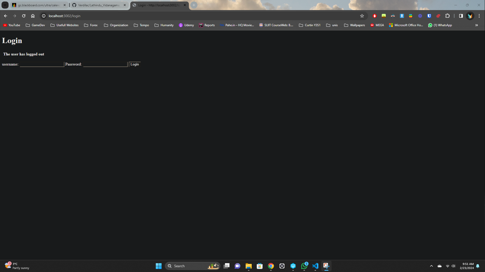
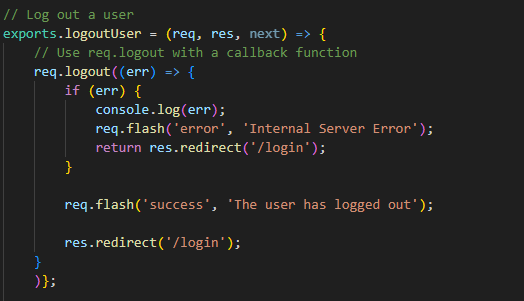
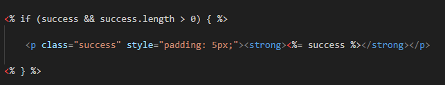

# Lab 7 Assignment by Lathindu

### Result of the Assignment

This image shows the layout after the user logs out from the protected page and into the login page.
 

### Codes - `authController.js` File

I had to add the redirect and the flash message to the existing controller "logoutUser".
 

### 3. Codes - `login.ejs` File

I just had to add a display to trigger if there is a success.
 
